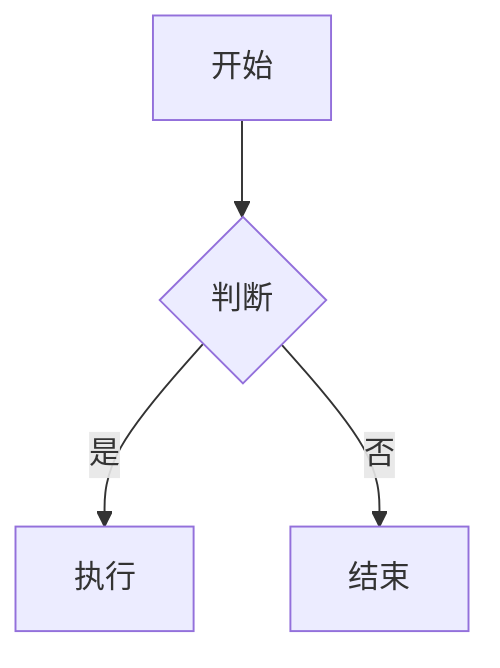

# Quartz 博客使用指南

## 快速开始

### 本地预览

```bash
cd ~/quartz-blog

# 启动本地开发服务器（带热更新）
npx quartz build --serve

# 或者只构建不预览
npx quartz build
```

浏览器打开 `http://localhost:8080` 即可预览。

### 发布文章

1. 在 `content/posts/` 目录下新建 `.md` 文件
2. 添加 frontmatter 元数据
3. `git push` 推送，GitHub Actions 自动部署

```bash
git add -A
git commit -m "feat: new post about X"
git push
```

---

## 文章格式

### Frontmatter

每篇文章顶部必须包含 YAML frontmatter：

```yaml
---
title: 文章标题          # 必填
date: 2026-07-14        # 发布日期
tags:                   # 标签（可选，支持多个）
  - security
  - web
aliases:                # 别名（可选，用于内部链接）
  - 别名1
  - 别名2
---
```

### Markdown 语法

Quartz 支持标准 Markdown + Obsidian 扩展语法：

**内部链接**
```markdown
[[quartz 教程]]          # 链接到别名为 "quartz 教程" 的页面
[[guide|我的指南]]        # 自定义显示文字
```

**Callout 提示框**
```markdown
> [!note]
> 这是一个笔记提示框

> [!warning]
> 这是一个警告提示框

> [!tip]
> 这是一个技巧提示框

> [!info]
> 这是一个信息提示框
```

**代码块**
````markdown
```python
def hello():
    print("Hello, World!")
```
````

**数学公式**（LaTeX）
```markdown
行内公式: $e^{i\pi} + 1 = 0$

块级公式:
$$
\int_{0}^{\infty} e^{-x^2} dx = \frac{\sqrt{\pi}}{2}
$$
```

**Mermaid 图表**
````markdown

````

**表格**
```markdown
| 工具 | 用途 |
|------|------|
| Burp Suite | Web 渗透测试 |
| Ghidra | 逆向分析 |
| Wireshark | 流量分析 |
```

---

## 目录结构

```
quartz-blog/
├── content/              # 内容目录（你的文章放这里）
│   ├── index.md          # 首页
│   └── posts/            # 文章目录
│       ├── first-post.md
│       └── quartz-guide.md
├── quartz.config.default.yaml  # 站点配置
├── public/               # 构建输出（已 gitignore）
├── quartz/               # Quartz 框架代码
└── .github/workflows/    # GitHub Actions 部署配置
```

---

## 配置修改

编辑 `quartz.config.default.yaml`：

### 修改站点标题
```yaml
pageTitle: 我的博客
```

### 修改域名
```yaml
baseUrl: your-domain.com
```

### 启用/禁用功能
```yaml
plugins:
  - source: github:quartz-community/comments
    enabled: true       # 改为 true 启用评论
```

### 修改主题颜色
```yaml
theme:
  colors:
    lightMode:
      light: "#faf8f8"
      dark: "#2b2b2b"
      secondary: "#284b63"
    darkMode:
      light: "#161618"
      dark: "#ebebec"
      secondary: "#7b97aa"
```

---

## 常用命令

```bash
npx quartz build              # 构建站点
npx quartz build --serve      # 构建 + 本地预览
npx quartz build --verbose    # 详细输出
npx quartz plugin install     # 安装/更新插件
npx quartz sync               # 同步（拉取远程更新）
```

---

## 技巧

1. **私密文章**：frontmatter 加 `draft: true`，本地可见但不会发布
2. **固定链接**：加 `permalink: /custom-url/` 自定义 URL
3. **文章排序**：利用 `date` 字段自动排序
4. **双向链接**：多用 `[[wikilink]]` 建立笔记间的关联
5. **标签聚合**：Quartz 自动为每个 tag 生成聚合页面
