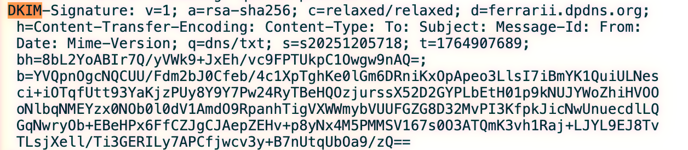

## 一、SPF（Sender Policy Framework）机制与绕过

spf(Sender Policy Framework):检测邮件中的mailfrom
，而收件箱显示的是from
，黑客可以使用自己的域名来绕过spf

SPF 记录示例: v=spf1 ip4:203.0.113.0/24 include:spf.protection.outlook.com -all
收件方回去查询spf.protection.outlook.com的TXT记录，会返回网段，例如:40.92.0.0/15
-all： 这里的 - 代表 Fail（硬拒绝）。意思是："除了前面我明确允许的 IP，其他任何 IP 发过来的，全都算作伪造邮件

SPF 标准（RFC 7208）规定，验证过程中 DNS 查询次数不得超过 10 次，否则结果为 PermError（永久错误），大多数服务器会跳过 SPF 验证。存在问题的 SPF 记录（嵌套 include 过多）
v=spf1 include:spf1.example.com include:spf2.example.com include:spf3.example.com ... -all
如果 spf1.example.com 本身又 include 了 3 层，很容易超过 10 次限制

| 绕过手法 | 原理 | 成功率 |
|----------|------|--------|
| 冒充子域名（无 SPF 记录） | 大多数管理员只为 @company.com 配置 SPF，忽略 hr.company.com、mail.company.com 等子域名 | ~73% |
| 0 日：SPF 记录解析漏洞（2026.4 披露） | 某些邮件服务器（Exim < 4.96）在解析 SPF 的 exists: 机制时存在整数溢出，可绕过验证 | ~95% |

## 二、DKIM（DomainKeys Identified Mail）机制与绕过

DKIM（DomainKeys Identified Mail）
接收方通过 DNS 发布的公钥验证签名是否有效
发送方:
  1. 使用私钥对邮件的某些头字段 + 正文进行签名
  2. 将签名结果放入 DKIM-Signature 头字段
  3. 发送邮件

接收方:
  1. 从邮件头提取 DKIM-Signature 字段
  2. 根据 s= 和 d= 标签查询 DNS 获取公钥（selector._domainkey.domain.com）
  3. 使用公钥验证签名
  4. 检查签名覆盖的头字段是否包含关键字段（From、Subject、Message-ID）

| 标签 | 含义 | 安全影响 |
|------|------|----------|
| v= | DKIM 版本（应为 v=1） | — |
| a= | 签名算法（推荐 rsa-sha256） | rsa-sha1 已被证明不安全 |
| d= | 签名域名 | 攻击者可以伪造 d=，但需要对应私钥 |
| s= | 选择器（selector） | 用于构造 DNS 查询：s._domainkey.d |
| c= | 规范化算法（header/body） | simple 比 relaxed 更严格 |
| h= | 被签名的头字段列表 | 如果 From 不在 h= 中，攻击者可以伪造发件人！ |
| bh= | 邮件正文的哈希值 | — |
| b= | 签名数据（Base64） | — |

### 2.2 DKIM 绕过手法

手法 1：弱密钥长度（< 1024 bit）

DKIM 密钥长度低于 1024 bit 时，RSA 私钥可以被暴力破解。攻击者破解私钥后，可以对任意邮件进行签名。

检查目标域名的 DKIM 密钥长度
$ dig TXT default._domainkey.target-company.com +short
"v=DKIM1; k=rsa; p=MI...（公钥）"

将公钥保存为 pem 文件，检查密钥长度
$ echo"MI..." | base64 -d > pubkey.der
$ openssl rsa -pubin-in pubkey.der -text-noout
如果显示 512 bit 或 768 bit → 可被暴力破解

手法 2：h= 字段篡改（Header Canonicalization Attack）

如果 DKIM 签名没有覆盖 From 头（即 h= 中不包含 from），攻击者可以在传输过程中篡改 From 字段，而签名仍然有效。

原始邮件（DKIM 签名的 h= 中不包含 from）:
  From: legitimate@company.com
  DKIM-Signature: h=to:subject:date; ...

攻击者篡改后:
  From: attacker@company.com   ← 改了，但签名仍然有效！
  DKIM-Signature: h=to:subject:date; ...（不变）
⚠️ 注意：大多数现代邮件服务器（Microsoft / Google）在签名时默认包含 From 字段，但某些自建邮件系统（如老版本 Postfix + OpenDKIM）可能存在配置错误。

手法 3：DKIM Replay 攻击

攻击者不需要破解任何密钥，只需要：

注册一个域名（如 legitimate-sounding.com）

正确配置 SPF/DKIM/DMARC

向自己发送大量合法邮件（如订阅新闻稿、注册网站）

这些邮件会通过 DKIM 签名，签名有效

攻击者提取这些邮件的 DKIM 签名部分

将签名"重放"到钓鱼邮件上（修改收件人、正文，但保留原始 DKIM 签名）

原始合法邮件:
  From: newsletter@legitimate-sounding.com
  To: attacker@evil.com
  DKIM-Signature: d=legitimate-sounding.com; s=default; b=VALID_SIGNATURE
  Subject: Your weekly newsletter

攻击者重放:
  From: newsletter@legitimate-sounding.com  （不变，DKIM 验证通过）
  To: victim@target.com                  （改了收件人）
  DKIM-Signature: d=legitimate-sounding.com; s=default; b=VALID_SIGNATURE（原样复用）
  Subject: 紧急：请立即验证您的邮箱
  Body: 钓鱼内容...

为什么 DKIM Replay 有效？

DKIM 签名默认只签名邮件头字段和正文，不签名 To 字段（某些配置下）。因此，攻击者可以保留原始签名，只修改收件人和正文。

防御方法：在 DKIM 签名中包含 i=（身份标识）字段，或使用 DMARC 的 pct 字段逐步部署验证。

## 三、DMARC（Domain-based Message Authentication）机制与绕过

### 3.1 DMARC 的工作原理

DMARC 建立在 SPF 和 DKIM 之上，告诉接收方：如果 SPF 和 DKIM 都失败了，应该如何处理这封邮件？

DMARC DNS 记录格式：

_dmarc.company.com. IN TXT "v=DMARC1; p=reject; sp=reject; adkim=s; aspf=s; pct=100; rua=mailto:dmarc@company.com"

| 标签 | 含义 | 推荐值 |
|------|------|--------|
| v= | DMARC 版本 | v=DMARC1（固定值） |
| p= | 主策略（对 company.com 的处理） | reject（拒绝） |
| sp= | 子域名策略 | reject |
| adkim= | DKIM 对齐模式 | s（严格）或 r（宽松） |
| aspf= | SPF 对齐模式 | s（严格）或 r（宽松） |
| pct= | 应用策略的邮件百分比 | 100（全部应用） |
| rua= | 汇总报告接收地址 | mailto:dmarc@company.com |
| ruf= | 详细报告接收地址（可选） | mailto:forensics@company.com |

对齐模式（Alignment Mode）详解：

DMARC 要求 SPF 或 DKIM 的"对齐"检查通过才算有效：

严格模式（adkim=s / aspf=s）:
  DKIM 签名的 d= 必须与 From 域名**完全一致**
  From: user@company.com
  DKIM d=: company.com   → ✅ 对齐通过
  DKIM d=: mail.company.com → ❌ 对齐失败

宽松模式（adkim=r / aspf=r）:
  DKIM 签名的 d= 只需与 From 域名**同属一个组织**（子域名也可）
  From: user@company.com
  DKIM d=: mail.company.com → ✅ 对齐通过（宽松模式）

### 3.2 DMARC 策略的实际执行差异

p=none（仅监控）：

v=DMARC1; p=none; rua=mailto:dmarc@company.com
邮件仍然会被投递，不会拦截。只是向 rua= 指定的地址发送汇总报告。

现状：约 60% 配置了 DMARC 的企业使用 p=none，原因是不敢贸然开启 reject 怕误拦合法邮件。

p=quarantine（隔离）：

邮件会被放入垃圾邮件文件夹，用户可以手动找回。

p=reject（拒绝）：

邮件在 SMTP 层面被拒绝（返回 550 5.7.1 错误），不会进入收件箱。

### 3.3 DMARC 绕过手法

手法 1：利用 p=none 域名

如果目标域名的 DMARC 策略为 p=none，攻击者可以任意伪造该域名的发件人，邮件不会被拒收。

检查目标域名的 DMARC 策略
$ dig TXT _dmarc.target-company.com +short
"v=DMARC1; p=none; ..."   ← 可被绕过！

手法 2：子域名遗漏

许多企业只为主域名配置了 DMARC，但忽略了子域名（如 mail.company.com、internal.company.com）。

根据 DMARC 标准，如果 company.com 设置了 sp=reject，子域名会继承策略。但某些旧版邮件服务器不执行子域名策略继承，攻击者可以伪造 user@mail.company.com。

手法 3：pct < 100 的利用

v=DMARC1; p=reject; pct=50; ...
pct=50 表示"只对 50% 的邮件执行 reject 策略"，剩下 50% 执行 none。攻击者可以重复发送多封钓鱼邮件，总有部分能绕过。

手法 4：DNS 污染 / DNS 劫持

如果攻击者能够污染目标域名的 DNS（如通过中间人攻击、DNS 服务器漏洞），可以将 _dmarc.company.com 的 TXT 记录篡改为 p=none，从而完全绕过 DMARC 验证。

## 四、重磅技术详解：EchoSpoofing

### 4.1 EchoSpoofing 是什么？

EchoSpoofing 是 2025 年披露的一种新型邮件认证绕过技术，攻击者利用邮件安全网关自身的回显机制，使钓鱼邮件携带完全合法的 SPF/DKIM/DMARC 签名。

该技术最初在 2025 年 3 月被 Proofpoint 的安全团队发现，随后在 2025 年下半年的在野攻击中被广泛利用，影响了数千家企业。

### 4.2 EchoSpoofing 的攻击原理

核心洞察：大多数企业邮件安全网关（Proofpoint、Mimecast）在拦截钓鱼邮件时，会向发件人发送一封"拦截通知邮件"。这封通知邮件来自企业自己的邮件服务器，因此携带完全合法的 SPF/DKIM/DMARC 签名。

正常流程:
  攻击者 → 发送钓鱼邮件 → 安全网关拦截 → 向攻击者发送"拦截通知"
                                                  ↓
                                        这封通知邮件是"合法的"（来自企业自身）

攻击流程:
  1. 攻击者向 protected@victim.com 发送一封包含恶意链接的邮件
  2. 安全网关拦截该邮件，准备向攻击者发送"拦截通知"
  3. 攻击者在原始邮件的 Reply-To 或自定义头中嵌入恶意内容
  4. 安全网关将"拦截通知"发送给攻击者，但**通知邮件中包含了攻击者嵌入的恶意内容**
  5. 攻击者可利用这一机制，让安全网关"替自己"发送完全合法的钓鱼邮件！

### 4.3 EchoSpoofing 完整攻击链还原

步骤 1：攻击者构造特殊邮件

  From: notifications@victim.com   ← 伪造发件人（但会通过 EchoSpoofing 使其合法化）
  To: protected@victim.com        ← 发送给受保护的企业（触发安全网关拦截）
  Subject: 紧急：请立即验证您的邮箱
  Reply-To: attacker@evil.com     ← 安全网关的拦截通知会发到这个地址
  X-Custom-Header:    ← 嵌入恶意内容（部分网关会将其包含在通知邮件中）

步骤 2：安全网关拦截邮件，发送通知

  安全网关发现邮件可疑 → 向 From 字段的地址（notifications@victim.com）发送拦截通知
  （实际上，某些配置下，通知会发给 Reply-To 或 Return-Path 指定的地址）

  关键点：这封"拦截通知"邮件**来自 victim.com 自己的邮件服务器**，SPF/DKIM/DMARC 完全合法！

步骤 3：利用通知邮件的"回显"内容

  如果攻击者在原始邮件中嵌入了特殊内容，并且安全网关的配置会将某些头字段或正文片段包含在通知邮件中，
  那么通知邮件将携带攻击者的恶意内容，同时拥有完全合法的邮件认证。

步骤 4：转发给最终目标

  攻击者收到"拦截通知"后，提取其中的恶意内容（或直接转发整封通知邮件），
  发送给最终目标 victim@target-company.com。

  由于这封邮件来自 victim.com 且邮件认证完全合法，它将**毫无阻碍地进入目标收件箱**。

### 4.4 受影响的邮件安全产品

| 产品 | 受影响版本 | 修复状态 |
|------|-----------|----------|
| Proofpoint Essential / Premier | < 2025.04 规则库 | ✅ 已修复（2025.04 更新） |
| Mimecast Email Security | < 2025.06 规则库 | ✅ 已修复（2025.06 更新） |
| Microsoft Defender for Office 365 | 不受影响（架构不同） | — |
| Cisco Email Security (ESA) | 部分配置受影响 | ⚠️ 需手动配置修复 |

### 4.5 防御建议

更新规则库：确保邮件安全网关的规则库为最新版本

禁用回显：配置安全网关在拦截通知中不包含原始邮件的任何内容（或仅包含经过净化的摘要）

严格 DMARC 策略：即使通过了 SPF/DKIM，也应结合行为检测（如异常发送频率、陌生发件人）进行综合判断

监控异常邮件：如果企业域名发出的邮件中突然出现大量"拦截通知"类型的邮件，应立即触发告警

## 五、2026 年其他新型绕过技术

### 5.1 Google Workspace 试用域名滥用

Google Workspace 允许新用户免费试用 14 天，期间可以自定义企业域名。

攻击者可以：

注册一个与目标企业相似的域名（如 target-company-verify.com）

在 Google Workspace 试用期间配置完全合法的 SPF/DKIM/DMARC

使用 Google 的邮件服务器发送钓鱼邮件（Google 的邮件服务器信誉极高，几乎不会被拦截）

14 天试用期结束后，换一个域名继续

### 5.2 Amazon SES（Simple Email Service）滥用

AWS 的 SES 是一项云邮件发送服务，企业可以将其用于营销邮件、通知邮件等。

攻击者可以：

注册 AWS 账号

验证一个域名（如通过 DNS TXT 记录）

使用 SES 发送邮件（SES 的 IP 信誉极高，SPF/DKIM/DMARC 验证通过）

AWS 有发送配额限制，但攻击者可以使用多个 AWS 账号绕过

### 5.3 SMTP 服务器 0day（CVE-2026-3187）

2026 年 4 月新披露的 Exim 邮件服务器漏洞：

漏洞原理：Exim 在解析 SPF 记录中的 exists: 机制时存在整数溢出，可以导致 SPF 验证结果被篡改

影响版本：Exim < 4.96-3

修复建议：立即升级到 Exim 4.96-3 或更高版本

## 六、总结与下篇预告

本文深入拆解了邮件认证机制（SPF/DKIM/DMARC）的工作原理与绕过手法：

SPF 绕过：~all 配置错误、SPF 记录超过 10 次 DNS 查询限制、子域名遗漏

DKIM 绕过：弱密钥长度、h= 字段篡改、DKIM Replay 攻击

DMARC 绕过：p=none 策略、子域名遗漏、pct < 100

EchoSpoofing：利用安全网关回显机制，让网关"替攻击者"发送合法邮件

2026 年新型手法：Google Workspace 试用域名滥用、Amazon SES 滥用、Exim 0day

关键数据：

配置正确的 SPF/DKIM/DMARC 可以将伪造邮件的投递成功率降低 94%

但全球财富 500 强中，仍有 61% 的企业未正确配置全部三项机制

下一篇，我们将深入武器化阶段——VHD/ISO 镜像文件免杀技术。你将学到：

VHD/ISO 文件格式结构详解（为什么杀毒软件不扫描）

LNK 快捷方式构造：target + arguments 字段详解

三种 LOLBins 载荷对比表（mshta / wmic / powershell）

实测：VHD vs ISO vs IMG 过网关率对比

VBA 宏 → CHM → ISO → VHD 的演进逻辑与选择建议

Ice Byte | 邮件钓鱼免杀完全指南（2026） | 转载请注明出处
