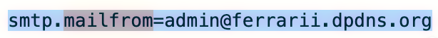

## 一、SPF（Sender Policy Framework）机制与绕过

### 1.1 机制

SPF 记录示例: v=spf1 ip4:203.0.113.0/24 include:spf.protection.outlook.com -all
收件方回去查询spf.protection.outlook.com的TXT记录，会返回网段，例如:40.92.0.0/15
-all： 这里的 - 代表 Fail（硬拒绝）。意思是："除了前面我明确允许的 IP，其他任何 IP 发过来的，全都算作伪造邮件

### 1.2 绕过方法

#### 方法1：MailFrom 与 From 不一致

SPF(Sender Policy Framework):检测邮件中的mailfrom，而收件箱显示的是from



黑客可以使用自己的域名来绕过spf


#### 方法2：DNS 查询次数限制

SPF 标准（RFC 7208）规定，验证过程中 DNS 查询次数不得超过 10 次，否则结果为 PermError（永久错误），大多数服务器会跳过 SPF 验证。存在问题的 SPF 记录（嵌套 include 过多）
v=spf1 include:spf1.example.com include:spf2.example.com include:spf3.example.com ... -all
如果 spf1.example.com 本身又 include 了 3 层，很容易超过 10 次限制

<br>

#### 其他方法

| 绕过手法 | 原理 | 成功率 |
|----------|------|--------|
| 冒充子域名（无 SPF 记录） | 大多数管理员只为 @company.com 配置 SPF，忽略 hr.company.com、mail.company.com 等子域名 | ~73% |
| 0 日：SPF 记录解析漏洞（2026.4 披露） | 某些邮件服务器（Exim < 4.96）在解析 SPF 的 exists: 机制时存在整数溢出，可绕过验证 | ~95% |

#### CVE-2026-3187：Exim exists: 机制整数溢出

2026 年 4 月新披露的 Exim 邮件服务器漏洞：

漏洞原理：Exim 在解析 SPF 记录中的 exists: 机制时存在整数溢出，可以导致 SPF 验证结果被篡改

影响版本：Exim < 4.96-3

修复建议：立即升级到 Exim 4.96-3 或更高版本

## 二、DKIM（DomainKeys Identified Mail）机制与绕过

### 2.1 机制

#### DKIM（DomainKeys Identified Mail）
接收方通过 DNS 发布的公钥验证签名是否有效

发送方:
  1. 使用私钥对邮件的某些头字段 + 正文进行签名
  2. 将签名结果放入 DKIM-Signature 头字段
  3. 发送邮件

接收方:
  1. 从邮件头提取 DKIM-Signature 字段
  2. 根据 s= 和 d= 标签查询 DNS 获取公钥（selector._domainkey.domain.com）
  3. 使用公钥验证签名
  4. 检查签名覆盖的头字段是否包含关键字段（From、Subject、Message-ID）


#### DKIM-Signature 标签

| 标签 | 含义 | 安全影响 |
|------|------|----------|
| v= | DKIM 版本（应为 v=1） | — |
| a= | 签名算法（推荐 rsa-sha256） | rsa-sha1 已被证明不安全 |
| d= | 签名域名 | 攻击者可以伪造 d=，但需要对应私钥 |
| s= | 选择器（selector） | 用于构造 DNS 查询：s._domainkey.d |
| c= | 规范化算法（header/body） | simple 比 relaxed 更严格 |
| h= | 被签名的头字段列表 | 如果 From 不在 h= 中，攻击者可以伪造发件人！ |
| bh= | 邮件正文的哈希值 | — |
| b= | 签名数据（Base64） | — |

### 2.2 绕过手法

#### 弱密钥长度（< 1024 bit）
DKIM 密钥长度低于 1024 bit 时，RSA 私钥可以被暴力破解。攻击者破解私钥后，可以对任意邮件进行签名

#### 签名覆盖不完整
如果 DKIM 签名没有覆盖 From 头（即 h= 中不包含 from），攻击者可以在传输过程中篡改 From 字段，而签名仍然有效

#### DKIM Replay 攻击
DKIM 签名默认只签名邮件头字段和正文，不签名 To 字段（某些配置下）。因此，攻击者可以保留原始签名，只修改收件人和正文

```
【 第一阶段：合法生产签名母本 】
 攻击者 (控制域名: evil-reputation.com)
   │
   ├─► 1. 注册亚马逊 AWS/网易等商业邮件推送服务 (SES)
   ├─► 2. 在自己域名的 DNS 中配置商业服务要求的 CNAME (授权商业服务代管私钥)
   │
   └─► 3. 通过商业服务发信 ──► [ 收件人: 自己另一个邮箱 attacker@qq.com ]
                               [ 正文: 钓鱼链接 http://phish.com ]
                                     │
                                     ▼
                      ┌──────────────────────────────┐
                      │    商业邮件推送服务服务器     │
                      │ ──────────────────────────── │
                      │ 掏出代管私钥, 对 From/Body   │
                      │ 进行哈希计算, 盖上合法印章:  │
                      │ d=evil-reputation.com; s=..  │
                      └──────────────┬───────────────┘
                                     │
                                     ▼ (成功投递)
                      [ 攻击者收件箱 attacker@qq.com ]
                        (成功拿到带有完美签名的邮件源码)

 ───────────────────────────────────────────────────────────────────────

【 第二阶段：恶意重放与接收方校验 】
 攻击者收件箱
   │
   ├─► 4. 提取邮件源码 (包含 From: newsletter@evil-reputation.com, 
   │                   Subject, Body 以及合法的 DKIM-Signature)
   │
   └─► 5. 编写脚本，脱离商业服务，直接连接【受害者企业邮件网关 (SEG)】
          ┌────────────────────────────────────────────────────────┐
          │ 协议层命令 (信封): MAIL FROM:<newsletter@evil-reputation.com>│
          │                   RCPT TO:<victim@target.com> (改目标) │
          │ ────────────────────────────────────────────────────── │
          │ 数据层内容 (信头/正文): 完美复用第一阶段的源码，一丝不改    │
          └──────────────────────────┬─────────────────────────────┘
                                     │ (投递流)
                                     ▼
                      ┌──────────────────────────────┐
                      │    受害者企业邮件服务器      │
                      └──────────────┬───────────────┘
                                     │
               ┌─────────────────────┴─────────────────────┐
               ▼ [开始进行 DKIM 校验]                      ▼ [开始进行 DMARC 校验]
         提取邮件中的签名标签                          提取信头 From 域名:
      d=evil-reputation.com                        evil-reputation.com
               │                                           │
               ▼                                           │
   向该域名 DNS 请求公钥                                    │
   (由于第一阶段配置过, 公钥必然存在)                        │
               │                                           │
               ▼                                           ▼
   使用公钥解密签名, 并对比                              检查 DKIM 域名与 From 域名
   From/Subject/Body 的哈希值                           是否完全一致 (Alignment)
               │                                           │
      ┌────────┴────────┐                                  │
      ▼                 ▼                                  ▼
 发生篡改?          一丝没动!                     【DMARC 完全对齐 Pass】
(DKIM Fail)     (DKIM Perfect Pass)                        │
                                                           ▼
                                               【进入受害者收件箱 📥】
```